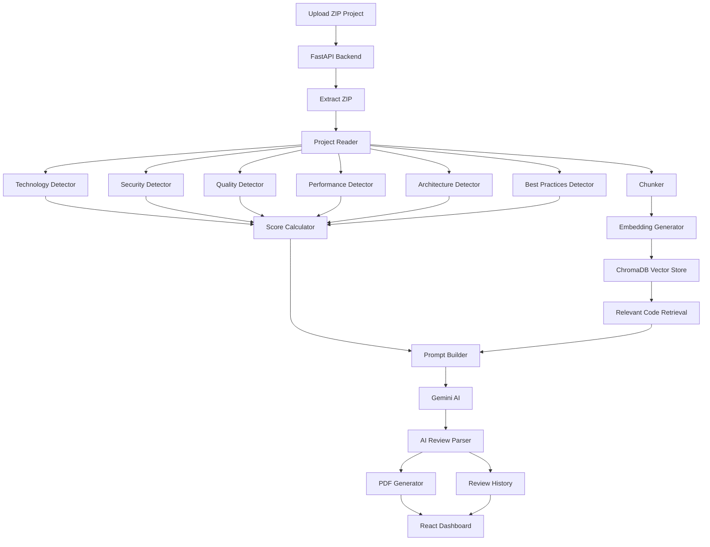

# 🤖 AI Software Engineering Reviewer

An AI-powered Software Engineering Review Platform that automatically analyzes software projects and generates comprehensive engineering reports using AI and static code analysis.

The platform reviews uploaded projects, detects technologies, identifies security vulnerabilities, evaluates code quality, analyzes architecture and performance, generates AI-powered recommendations, creates downloadable PDF reports, and maintains review history with analytics.

---

# ✨ Features

## 📁 Project Analysis

- Upload project as ZIP
- Automatic project extraction
- Recursive project scanning
- Multi-language project support

---

## 🤖 AI Review

Generate AI-powered engineering reviews including:

- Overall Summary
- Project Strengths
- Weaknesses
- Security Improvements
- Performance Improvements
- Code Quality Suggestions
- Final Verdict
- Engineering Score

---

## 🔍 Static Analysis

### Technology Detection

Automatically detects:

- React
- Next.js
- Angular
- Vue
- Node.js
- Express
- Spring Boot
- Django
- Flask
- MongoDB
- MySQL
- PostgreSQL
- SQLite

---

### Code Quality Analysis

Detects:

- Console Logs
- TODO comments
- FIXME comments
- debugger statements
- eval()
- var usage

---

### Security Analysis

Detects:

- Hardcoded API Keys
- Passwords
- Secrets
- Tokens
- AWS Credentials
- Private Keys

---

### Performance Analysis

Detects:

- innerHTML usage
- setInterval usage
- console.time
- Synchronous File Operations

---

### Architecture Analysis

Checks project structure:

- README
- package.json
- src
- public
- tests
- .gitignore

---

### Best Practices

Checks:

- Dockerfile
- ESLint
- Prettier
- package-lock
- tsconfig
- .env.example

---

# 📄 PDF Report

Automatically generates a professional PDF containing:

- Overall Score
- Technology Stack
- Project Structure
- Security Findings
- AI Engineering Review

---

# 📚 Review History

- Store previous reviews
- Search reviews
- Sort reviews
- View review details
- Delete reviews

---

# 📊 Analytics Dashboard

Displays

- Total Reviews
- Average Score
- Best Score
- Lowest Score
- Frontend Distribution
- Backend Distribution
- Database Distribution
- Interactive Charts

---

# 🏗 System Architecture



---

# 🛠 Tech Stack

## Frontend

- React.js
- Bootstrap 5
- React Router
- Axios
- Chart.js
- React ChartJS 2
- React Hot Toast

---

## Backend

- Python
- FastAPI

---

## AI

- Google Gemini API
- Sentence Transformers
- ChromaDB

---

## Libraries

- ReportLab
- pathlib
- shutil
- zipfile
- uuid

---

# 📂 Project Structure

```
backend/
│
├── agents/
├── database/
├── review/
├── services/
├── uploads/
└── main.py

frontend/
│
├── components/
├── pages/
├── services/
└── App.jsx
```

---

# 🚀 Getting Started

## Backend

```bash
cd backend

pip install -r requirements.txt

uvicorn main:app --reload
```

Backend runs at

```
http://127.0.0.1:8000
```

---

## Frontend

```bash
cd frontend

npm install

npm run dev
```

Frontend runs at

```
http://localhost:5173
```

---

# 📡 API Endpoints

| Method | Endpoint | Description |
|---------|----------|-------------|
| GET | / | Home |
| POST | /upload | Upload ZIP Project |
| GET | /download-report | Download PDF Report |
| GET | /reviews | Get Review History |
| DELETE | /reviews/{id} | Delete Review |
| GET | /stats | Analytics |

---

# 🔮 Roadmap

Planned improvements:

- Code Complexity Detector
- Duplicate Code Detector
- Dead Code Detector
- Naming Convention Detector
- Documentation Detector
- Dependency Detector
- Test Coverage Detector
- GitHub Repository Analysis
- Authentication & Authorization
- Docker Support
- CI/CD Integration
- Cloud Deployment

---

# 👩‍💻 Author

**Vanika Jain**

Full Stack Developer

---

# 📄 License

This project is intended for learning, portfolio showcase, and demonstration purposes.